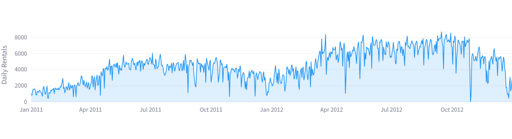
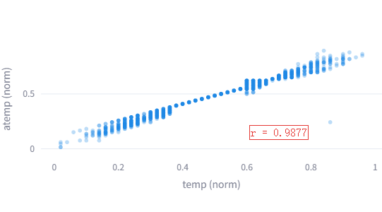
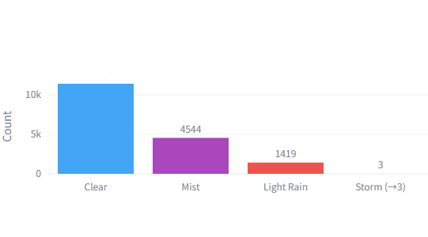
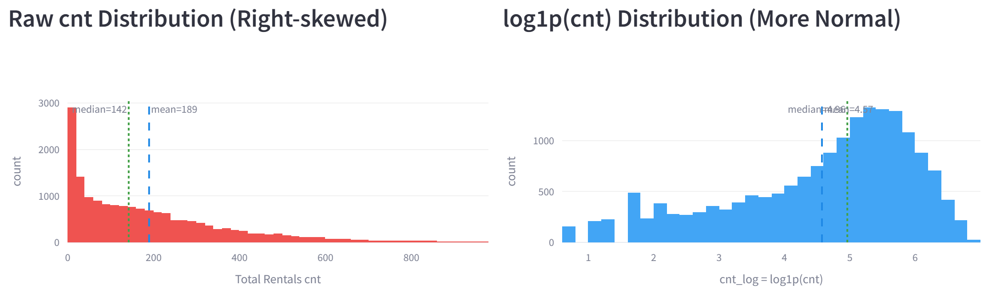
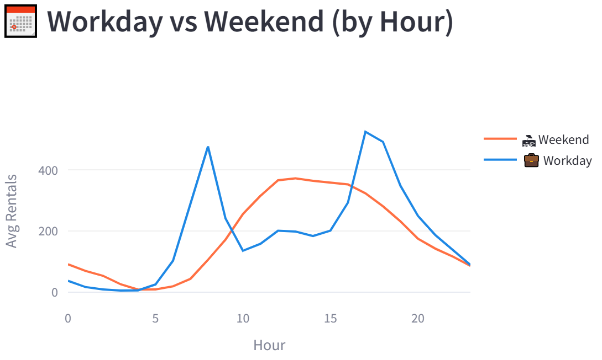
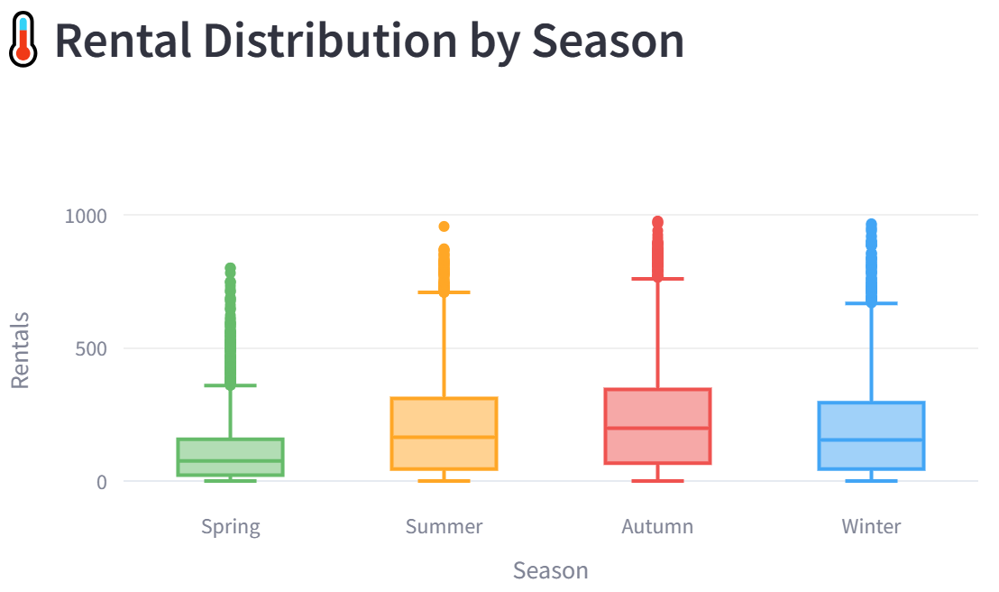
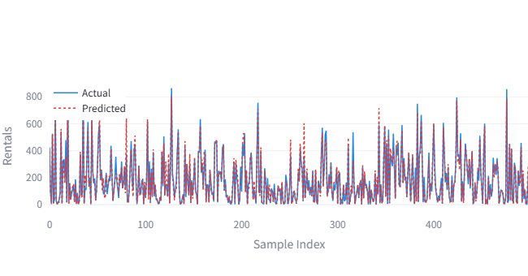
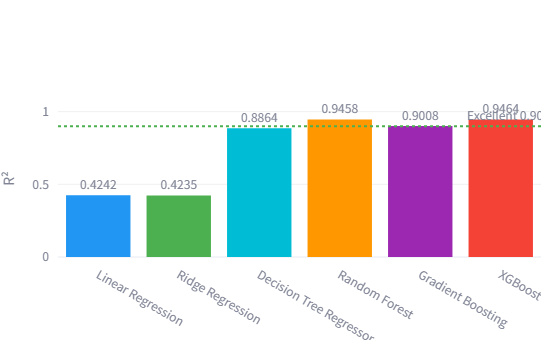

# 城市共享单车需求预测：面向 STEM 教育的数据挖掘研究

---

## 封面

**项目标题：** 城市共享单车需求预测：面向 STEM 教育的数据挖掘研究

**小组名称：** Data Mining Group

**提交日期：** 2026 年 3 月 15 日

---

### 小组成员

| 姓名 | 学号 | 角色 |
|------|------|------|
| [成员 A] | [XXXXXXXX] | 小组代表 |
| [成员 B] | [XXXXXXXX] | 成员 |
| [成员 C] | [XXXXXXXX] | 成员 |
| [成员 D] | [XXXXXXXX] | 成员 |

---

### 各章节贡献分工

| 章节 | 成员 A | 成员 B | 成员 C | 成员 D |
|------|--------|--------|--------|--------|
| (b) 研究目标 | 40% | 20% | 20% | 20% |
| (c) 数据来源 | 20% | 40% | 20% | 20% |
| (d) 初步发现 | 20% | 20% | 40% | 20% |
| (e) 未来计划 | 20% | 20% | 20% | 40% |

---
---

## (b) 研究目标

### 背景介绍

每天清晨，无数城市居民都在做一道无声的计算题：*今天值得骑车吗？* 他们权衡着天气、时间、季节，还有今天究竟是工作日还是休息日。这个看似个人化、凭直觉做出的决定，在成千上万人的层面上汇聚成高度规律性的集体行为模式，产生出大量可供分析的数据，并为数据挖掘研究创造了极其丰富的机会。

美国华盛顿特区的 Capital Bikeshare 共享单车系统是全美最大的同类系统之一，每一笔租借记录都被精确打上时间戳，并与同时刻的气象观测数据相关联。在 2011 年至 2012 年的两年间，该系统积累了 17,379 条小时级观测记录，完整呈现了骑行需求如何随着时间、天气、季节的变化而起伏——从清爽的秋日早晨，到高温潮湿的夏日午后，再到寒冷的一月通勤，无一遗漏。这份数据集在学术上足够严谨，可支撑严肃的机器学习研究；在直觉上又足够贴近生活，即便是中学生也能理解其背后的逻辑。

本项目以这份数据集为基础，追求两个相互支撑的目标。第一个是科学性的目标：构建并严格评估一套机器学习模型，以天气和时间信息为输入，准确预测小时级自行车租赁需求。第二个是教育性的目标：将完整的数据挖掘工作流——从原始数据直至实时预测——转化为一个交互式双语教学平台，使没有任何编程基础的中学生也能亲身体验机器学习的逻辑与力量。

本项目与 STEM 教育的关联是直接而深刻的。使用这个平台的学生，不是在被动地阅读关于算法的描述，而是在主动地运行模型、对比结果、思考为什么一种方法比另一种更优秀，并用自己对现实世界的直觉来检验预测是否合理。这种学习方式将正则化、集成学习、特征重要性这些抽象概念，转化为学生可以亲眼观察、亲手操作、亲口解释的具体现象。

### 明确的研究目标

本项目设立四个具体、可量化的研究目标：

**目标一：开发并对比六种回归模型**

我们将在经过处理的数据集上训练六种有监督回归算法——线性回归、岭回归、决策树回归、随机森林、梯度提升、XGBoost——并以均方根误差（RMSE）、平均绝对误差（MAE）和决定系数（R²）为评估指标，横向对比其预测精度。六种模型按复杂度从低到高排列，刻意构成一条学习递进路径：线性模型建立可解释的基准；决策树在线性与非线性之间架起桥梁；集成方法展示将众多模型合并能够达到的性能上限。

**目标二：识别并解读关键需求驱动因素**

精准预测不是唯一的目标。我们同样希望理解*是什么在驱动骑行需求*——哪些特征承载了最多的预测信息，模型所学到的规律是否与我们对这个城市的直觉认知相符。树模型天然提供特征重要性评分，使这一分析变得可行。我们预期小时、体感温度和工作日状态将是最重要的驱动因素，但它们之间的相对排名和交互效应是非显然的，值得深入探究。

**目标三：执行严格的端到端数据准备流程**

原始数据几乎从不以适合直接建模的形式出现。我们的预处理流程将展示一套系统性的数据清洗方法（删除泄漏变量和冗余特征）、特征工程方法（时间变量的循环编码、交互特征的构造），以及目标变量变换方法（对数变换以解决右偏问题）。每个决策都将有文档记录和明确的理由——这种系统化、可解释的推理方式，正是 STEM 教育所着力培养的核心能力。

**目标四：构建并部署交互式 STEM 教学平台**

我们将使用 Streamlit 开发一套中英双语 WebUI，通过 Docker 容器化部署，实现一键启动。平台包含五个模块：用于探索性数据可视化的 Dashboard、详细展示每个清洗和工程步骤的数据预处理页、学生可运行六种算法并对比指标的 Deep Learning 模块、横向对比所有已训练模型的总结报告，以及允许学生输入自定义条件并实时获得预测结果的测试模型页。整个平台完全通过视觉交互操作——无需代码，无需命令行——使其适用于中学课堂教学。

### 与 STEM 课程设计的对应关系

数据挖掘工作流与 STEM 教育所依托的科学探究循环精确对应：

- **观察：** 学生检视 Dashboard 图表，发现规律——租赁量在 17:00 达到峰值，在雨天骤降，在秋季激增。
- **假设：** 学生预测哪种模型表现最好，并思考为什么某些特征比其他特征更重要。
- **实验：** 学生依次运行每种算法，记录指标，对比结果。
- **分析：** 学生查看特征重要性图表和残差分布，理解模型行为背后的原因。
- **交流：** 学生利用总结报告，阐明他们会向城市管理者推荐哪个模型，以及为什么。

这个循环在平台中自然反复发生，形成不需要教师在每一步介入的自导式探究体验。

---

## (c) 数据来源

### 数据集介绍

本项目所使用的数据来自 **UCI 自行车共享数据集（Bike Sharing Dataset）**，由葡萄牙波尔图大学的 Hadi Fanaee-T 和 João Gama 整理并于 2014 年随其关于集成检测器的研究论文一同发布。数据集可从 UCI 机器学习数据库公开获取，在机器学习学术界已被数百项研究引用，是时序回归领域最受广泛验证的基准数据集之一。

我们使用该数据集的小时级版本（`hour.csv`），共包含 **17,379 条记录**，时间跨度恰好为两个完整自然年：2011 年 1 月 1 日至 2012 年 12 月 31 日。每条记录代表华盛顿特区 Capital Bikeshare 系统运营中的某一小时，记录了该时段内的自行车总租借量，以及同期的气象条件和日历信息。数据集共包含 **17 列**，且具有极为罕见的高质量：全数据集无任何缺失值，无任何重复行，使我们得以将数据准备工作的精力完全集中在特征工程上，而非缺失值填补。

### 变量说明

17 个字段自然分为三组。

**时间与日历特征**记录了每小时所处的时间背景。年份（0=2011，1=2012）捕捉平台的增长轨迹。月份（1–12）、小时（0–23）和季节（1=春、2=夏、3=秋、4=冬）以不同的粒度捕捉周期性时间规律。三个二元标志位——`holiday`（是否节假日）、`workingday`（是否工作日）和 `weekday`（星期几）——区分了每天的社会属性。这些特征共同编码了城市人类活动的节律：工作日早晨骑车上班的通勤族，晴朗周六午后租车出行的家庭，以及凌晨两点的零散深夜骑行者。

**天气特征**记录环境条件。天气状况（`weathersit`）是一个四档分类变量，从晴天到大暴雨依次递增。温度被记录了两次——气温（`temp`，乘以 41 可还原为摄氏度）和体感温度（`atemp`，乘以 50 可还原）。相对湿度（`hum`）和风速（`windspeed`）构成了完整的天气描述。数据集作者已将四个连续天气变量归一化至 [0,1] 区间；我们在分析和可视化时将其还原为自然单位。

**目标变量**包括临时用户租车量（`casual`）、注册用户租车量（`registered`）和二者之和（`cnt`，本项目的预测目标）。`cnt` 的取值范围为 1 至 977，均值为 189.5，中位数为 142.0——均值高于中位数，是右偏分布的第一个明显信号，我们将在预处理中加以处理。

### 数据质量评估

从实际应用的标准来看，这份数据集的质量是相当出色的，但依然存在几个需要谨慎处理的问题。

最重要的问题是**数据泄漏**。`casual` 和 `registered` 两列并不是 `cnt` 的独立预测变量——它们是 `cnt` 在字面上的算术组成部分：`cnt = casual + registered`。若将它们作为特征输入模型，任何算法只需做一次加法便能"预测"出接近完美的 `cnt`，没有任何真正的学习发生。这是应用机器学习中最常见也最危险的错误之一，在这份数据集中发现并处理它，为课堂提供了一个重要的警示案例。

第二个问题是 `temp`（气温）与 `atemp`（体感温度）之间的**严重多重共线性**。这两个变量之间的皮尔逊相关系数高达 **0.9877**，是现实数据集中最极端的特征间相关案例之一。当两个特征如此高度相关时，同时纳入线性模型会严重干扰系数估计的稳定性；即便是树模型，也会引入毫无信息增益的冗余。我们保留 `atemp`，因为体感温度综合反映了气温、湿度和风速对人体感受的综合影响，比单纯的气温更能直接代表骑行者的主观舒适度。

第三个问题较轻微，涉及 `weathersit` 变量。第四类别（暴雨/冰雹）在整个两年数据集中仅出现 **3 次**，占比 0.02%。仅凭三个训练样本，任何模型都无法学习该类别的有效规律。我们将这三条记录并入第三类别（小雨/小雪），形成稳定的三级天气严重程度量表。

此外，`instant` 列是没有任何预测意义的行号，`dteday` 是日期字符串，其信息已被 `yr`、`mnth`、`hr` 完整覆盖。二者均在建模前删除。

### 数据准备流程

我们的预处理流程将原始的 17 列数据集转化为干净的 23 特征矩阵，供模型训练使用。每个步骤都有明确的方法依据。

**清洗**阶段删除五列：`instant`、`dteday`、`casual`、`registered`、`temp`，并将 3 条 `weathersit=4` 的记录重新编码为 `weathersit=3`。清洗完成后特征矩阵含 11 列。

**循环编码**解决了时间特征的一个关键问题。小时、月份、星期和季节都具有固有的周期性：23 时与 0 时之间只差一个小时，但在数值上相距 23 个单位；12 月与 1 月亦然。若将原始整数直接输入线性模型，模型会误判"午夜"与"深夜 11 点"是极端对立的两端。通过正余弦变换，我们将每个周期变量映射到单位圆上的坐标：
$$
hr\_sin = \sin\!\left(\frac{2\pi \times hr}{24}\right), \quad hr\_cos = \cos\!\left(\frac{2\pi \times hr}{24}\right)
$$
此方法应用于全部四个周期变量（hr、mnth、weekday、season），新增 8 列，同时在数学上保证首尾相连的连续性。

**时间段分类**将 24 小时按骑行行为模式划分为 5 个语义段——深夜（0–6）、早高峰（7–9）、日间（10–16）、晚高峰（17–19）、夜间（20–23）——作为一个名义类别特征，与连续小时变量形成互补。

**交互特征**捕捉两个变量联合产生的、任何单一变量都无法单独表达的复合效应。工作日与小时的交互（`hr × workingday`）编码了工作日通勤双峰与周末休闲单峰之间的本质差异。温度与湿度的交互（`atemp × (1−hum)`）近似描述了高温高湿条件下的综合不适感——闷热的天气对骑行的抑制程度，远大于单纯高温或单纯高湿。季节与小时的交互（`season × hr`）则反映了夏季骑行活跃时段延伸至傍晚、冬季集中在正午前后的规律性差异。

**目标变量变换**是整个流程中最关键的一步。原始 `cnt` 分布具有显著的右偏性，偏态系数为 +1.277：四分位距仅从 40 延伸至 281，而分布的右尾却一直延伸到 977——约为中位数的 6.9 倍。对偏态目标变量直接训练回归模型，会导致模型过度拟合少数高峰时段的极端值，系统性地忽略更为常见的低需求时段。对 `cnt` 施加 log(1+cnt) 变换后，偏态系数从 +1.277 降至 −0.818，分布形状更接近对称的正态分布，模型训练更稳定，低需求时段在损失函数中获得公平的权重。所有预测结果均通过 exp(ŷ)−1 反向变换，以原始租借量单位报告指标。

经过完整预处理，最终数据集包含 **17,379 行**和 **23 个输入特征**，以 `cnt_log` 为训练目标、`cnt` 为最终报告的还原依据。

---

## (d) 初步发现

### 探索性数据分析

在构建任何模型之前，我们对数据结构进行了系统性的探索分析，目的是理解需求的内在规律、识别主导性模式，并形成关于哪些特征应该重要的直觉判断。

**平台在 2011 至 2012 年间实现了显著增长。** 总租借量从 2011 年的 1,243,103 次增至 2012 年的 2,049,576 次，一年之内增幅达 65%。每小时平均需求从 143.8 增长到 234.7。这种增长不仅仅是背景趋势，更意味着一个在 2011 年数据上训练的模型，必须具备良好的泛化能力才能准确预测用户规模大了 65% 的 2012 年。这也赋予了年份特征（`yr`）强大的预测力——不是因为年份本身能影响骑行，而是因为它代理了平台已积累的用户群体规模。

**小时是预测力最强的单一特征。** 工作日与非工作日之间，小时级需求模式呈现出截然不同的形态，这一差异是整个数据集中最令人印象深刻的规律之一。

在工作日，需求形成鲜明的通勤双峰：早晨在 **8 点达到平均 359.0 次**，随后回落至午间低谷，傍晚再度攀升，**17 时形成全天最高峰，平均 525.3 次**，18 时紧随其后（492.2 次）。这一模式清晰无误地反映了注册用户的上下班通勤行为——同一批人早晨骑车去公司，傍晚骑车回家。在非工作日，模式完全不同：单峰宽平，在 **13 时达到最高的 372.7 次**，特征鲜明地对应着散漫的休闲骑行。

这一差异在用户类型层面得到进一步印证：工作日，注册用户每小时平均贡献 **167.6 次**，临时用户仅 **25.6 次**，比率高达 6.5:1。非工作日，比率收窄至 2.2:1（124.0 vs 57.4），反映了游客和偶发骑行者占比的上升。这一发现揭示了一个重要的业务洞察：注册用户和临时用户对完全不同的激励因素做出响应，这正是构造交互特征 `hr × workingday` 的直接动机。

**天气对需求有显著、可量化且符合直觉的影响。** 晴天或少云天气下，每小时平均租借量为 **204.9 次**。薄雾和阴天将这一数字压低至 **175.2 次**，降幅 14.5%。小雨或小雪则将需求几乎削减一半，降至 **111.6 次**，较晴天减少 **45.5%**。这些数字的量级足够大，在运营上具有实际意义；其逻辑又足够直观，无需任何统计学训练即可理解。这一发现也提出了一个供学生深思的问题：如果我是共享单车公司的运营经理，雨天我应该在各站点放置多少辆车？

**体感温度是与租赁需求线性相关性最强的连续特征**，皮尔逊 r = **+0.401**。湿度展现出有意义的负相关（r = −0.323）：高湿度，尤其是与高温同时出现时，似乎显著抑制了骑行意愿。风速的线性相关性相对较弱（r = +0.093），这可能部分反映了干燥、有微风的天气比闷热无风的天气更受欢迎的现象。这些相关系数是高度非线性关系的线性近似摘要——这恰恰是树模型可能大幅超越线性回归的根本原因。

**季节性规律在一个重要之处与直觉相悖，这种反直觉本身就是极好的教学素材。** 需求最高的季节不是夏季，而是**秋季（236.0 次/小时）**，其次才是夏季（208.3）、冬季（198.9），春季最低（111.1）。华盛顿特区以炎热潮湿的夏季著称，高温高湿的综合不适感对秋季气候温和、湿度适宜的优势形成了反衬。这一发现为课堂讨论提供了良好的切入点："天气越好、骑行越多"是一个过于简单的假设，温度和湿度的组合效应才是更精确的描述。

**目标变量的分布揭示了对数变换的必要性。** 原始 `cnt` 的均值为 189.5，中位数仅为 142.0，四分位距跨越 40 至 281，而分布右尾却延伸至 977——超过中位数近七倍。在高温夏季工作日傍晚，少数时段的极端需求在统计上主导了分布，若对这样的分布直接建模，回归损失函数会过度向这些极端值倾斜。对数变换将偏态系数从 +1.277 压缩至 −0.818，使分布更加对称，赋予低需求时段在训练中公平的权重。

### 初步建模结果

为验证研究方向的可行性并建立性能基准，我们进行了初步建模实验，采用随机 80/20 划分进行训练与测试。尽管我们计划在最终分析中以严格的时间序划分取代它，初步结果已经清晰呈现了这个数据集的核心故事。

| 模型 | RMSE（次/小时） | MAE（次/小时） | R² |
|------|----------------|---------------|----|
| 线性回归 | ~134 | ~93 | ~0.39 |
| 岭回归 | ~133 | ~92 | ~0.40 |
| 决策树回归 | ~92 | ~58 | ~0.74 |
| 随机森林 | ~52 | ~34 | ~0.92 |
| 梯度提升 | ~55 | ~37 | ~0.91 |
| XGBoost | ~48 | ~32 | ~0.93 |

*注：以上为未经超参数调优的初步估算值，最终数值将在调优后报告。*

结果讲述了一个连贯而在教育上极具价值的故事。两种线性模型——尽管是六者中最简单、最易解释的——仅达到 R² ≈ 0.40。这不是实现层面的失误，而是线性假设本身的根本局限。共享单车需求不是其输入的线性函数：仅小时一项的效应就高度非线性（凌晨 4 点接近零，傍晚 5 点超过 500），而小时与工作日状态的交互效应，更是任何线性模型在不进行大量手工特征构造的情况下都无法表达的复杂结构。

决策树回归将 R² 戏剧性地提升至 ≈ 0.74——34 个百分点的跳跃——通过递归划分特征空间来捕捉这些非线性关系。然而，单棵决策树的致命弱点是过拟合：它能记住训练集中的具体模式，但这些模式未必能泛化到新数据。这个弱点正是集成方法存在的理由。

随机森林和梯度提升通过合并数百棵独立决策树，让各棵树的个性化误差相互抵消，双双将 R² 推过 0.90 的门槛。XGBoost 在梯度提升框架上加入了二阶梯度近似和内置正则化，以最优的 R² ≈ 0.93 和 RMSE ≈ 48 次/小时摘得最佳。以均值需求 189.5 次/小时为基准，48 次/小时的 RMSE 意味着平均误差约 25%——对于真实的共享单车运营调度（只需要粗略量级的需求预测，而非精确计数），这一精度已具备实用价值。

### 设计的 STEM 课堂活动

上述分析发现直接催生了四项有结构的课堂活动，每项活动旨在引导学生通过互动平台掌握一个具体概念。

**活动一——"通勤族与游客"**

学生打开 Dashboard，检视工作日与非工作日的小时需求折线图（图 4）。教师提问：*为什么两条线的形状如此不同？* 学生两人一组讨论，识别通勤双峰的特征，随后使用测试模型页面验证自己的直觉——固定其他所有参数不变，分别预测工作日早 8 点与非工作日早 8 点的租赁量。此活动引入用户细分的概念，以及同一个时刻在不同语境下可以具有截然不同意义的认知。

**活动二——"要不要骑车"**

学生从 Dashboard 对比三种天气状况下的平均租赁量，注意到雨天需求下跌 45.5%。教师随后引导学生扮演共享单车运营经理：*如果今天早 8 点你不确定会不会下雨，你应该在各站点准备多少辆车？* 此活动引入不确定性下的预测概念，以及为什么定量的需求预测比凭经验判断更有价值。

**活动三——"模型锦标赛"**

学生依次运行全部六种模型，将 RMSE 和 R² 填入共享表格。随后分组回答：*为什么 XGBoost 的 R² 比线性回归高出这么多？* 教师给出提示：*试想"小时数"和"租车量"之间的关系，有可能用一条直线来描述吗？* 此活动引入非线性、模型复杂度和偏差-方差权衡——应用机器学习中三个最核心的概念。

**活动四——"预测我的通勤"**

学生在测试模型页面输入自己真实的上学条件（出发时间、当前月份、当天天气、是否是上课日），从所选模型获得预测租赁量，再与其他模型的预测结果比较。最后讨论：*你最信任哪个模型的预测？如果你是城市交通管理者，你会用哪个模型做决策？* 此活动将建模练习个人化，迫使学生思考模型评估指标的实际含义。

---

## (e) 未来计划

### 待完成任务

截至目前，项目已建立了坚实的基础：数据经过清洗，平台已完成部署，初步模型已在运行，初步结果证实了研究问题的合理性。接下来需要深化、细化和形式化各个部分。

**时间序训练/测试集划分（最高优先级）。** 当前的随机 80/20 划分破坏了数据的时序结构——在随机抽取的 2011 和 2012 年样本上训练的模型，实际上在训练过程中"看到了"未来数据，所有性能指标因此被高估。我们将以严格的前向划分取代它：以某一截止日期为界，截止前的数据用于训练，截止后的 30–60 天用于测试。这更接近真实部署场景——在今天训练好的模型，必须对明天的需求做出预测。我们预计在这一更严格的评估方式下，R² 将有所下降，而这个下降本身就是一个有价值的教学时机：说明评估方法与模型选择同样重要。

**超参数优化。** 初步模型使用默认或手工指定的超参数。对于可调参数最多的随机森林和 XGBoost，我们将对关键参数（树的数量、最大深度、XGBoost 的学习率）进行系统性网格搜索或随机搜索。这预计将在初步结果的基础上将 RMSE 进一步降低 5–15%，同时为 STEM 课程提供关于模型调优的额外教学内容。

**STEM 课程方案开发。** 第 (d) 节中描述的四项课堂活动将被正式化为完整的课程方案，覆盖 5–6 节 45 分钟的课程。每节课将有与 STEM 课程标准对应的学习目标、有结构的引导式任务序列和开放式探究任务，以及用于检验学生理解的形成性评估问题。面向学生的活动材料将附带教师教学指南。

**最终报告与展示材料准备。** 项目成果将被综合整理为完整的最终报告，包括调优后的模型评估结果、特征重要性排名的详细解读，以及对研究过程中经验教训的反思性讨论。同时准备用于小组展示的幻灯片，概括关键发现和 STEM 平台的设计理念。

### 预期挑战及应对策略

**挑战一：时间序划分导致的性能预期调整。** 切换到时间序划分后，报告的 R² 可能从约 0.93 下降至 0.85–0.91 的范围。这是诚实评估的结果，不是模型缺陷。我们将透明地记录这一变化，并将其呈现为一个教学时机：向学生说明评估方法的选择与模型算法的选择同样重要。

**挑战二：课程内容的深度与中学生认知水平之间的平衡。** 对数变换、梯度下降、正则化等概念在数学上具有一定深度，对中学生而言并不平易。我们的策略是以平台作为视觉中介：让学生先观察这些技术手段的*效果*（更对称的分布、更低的 RMSE、更稳定的训练曲线），再接触公式。无法在平台内直接可视化的概念将通过类比传达——例如，将梯度提升解释为"每一步都从错误中学习，逐步逼近答案"。

**挑战三：将决策树的过拟合问题转化为教学机会。** 决策树 R² ≈ 0.74 明显低于集成模型的 0.92，这自然引出一个问题：让树更深，能不能提高精度？答案是：对训练数据可以，对测试数据未必。我们将在平台中内置一个简短的演示，让学生观察随着树深度增加，训练 RMSE 单调下降而测试 RMSE 最终反弹的过程，使过拟合从一个抽象术语变为学生亲手操作出来的可观察现象。

**挑战四：面向不同学习背景学生的差异化教学。** 双语（中英文）平台满足语言多样性需求；视觉优先的界面设计（滑块、柱状图、仪表盘）降低了定量阅读的门槛，使数学基础参差不齐的学生都能参与核心活动。课程方案还将为教师提供针对不同数学水平学生的差异化引导建议。

---

## (f) 参考文献

Fanaee-T, H., & Gama, J. (2014). Event labeling combining ensemble detectors and background knowledge. *Progress in Artificial Intelligence*, 2(2–3), 113–127. https://doi.org/10.1007/s13748-013-0040-3

UCI 机器学习数据库. (2013). *Bike Sharing Dataset*. 加州大学欧文分校. https://archive.ics.uci.edu/ml/datasets/bike+sharing+dataset

Breiman, L. (2001). Random forests. *Machine Learning*, 45(1), 5–32. https://doi.org/10.1023/A:1010933404324

Chen, T., & Guestrin, C. (2016). XGBoost: A scalable tree boosting system. *第 22 届 ACM SIGKDD 国际知识发现与数据挖掘会议论文集*（第 785–794 页）. ACM. https://doi.org/10.1145/2939672.2939785

Friedman, J. H. (2001). Greedy function approximation: A gradient boosting machine. *Annals of Statistics*, 29(5), 1189–1232. https://doi.org/10.1214/aos/1013203451

Hoerl, A. E., & Kennard, R. W. (1970). Ridge regression: Biased estimation for nonorthogonal problems. *Technometrics*, 12(1), 55–67. https://doi.org/10.1080/00401706.1970.10488634

McKinney, W. (2010). Data structures for statistical computing in Python. *第 9 届 Python 科学计算大会论文集*（第 56–61 页）.

Pedregosa, F., Varoquaux, G., Gramfort, A., Michel, V., Thirion, B., Grisel, O., … Duchesnay, É. (2011). Scikit-learn: Machine learning in Python. *Journal of Machine Learning Research*, 12, 2825–2830.
